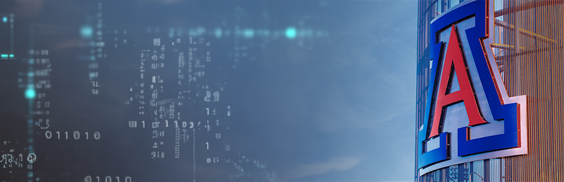

# Welcome to Arizona Digital! 🌵
A team of web-focused volunteers known as Arizona Digital meets weekly to build and test products like Arizona Bootstrap and Arizona Quickstart. Contributions are what keep these products moving and improving, and are in everyone's best interest.

## Contribution 🌈
As an open-source project, we count on the support and collaboration of amazing developers like you to keep Arizona Quickstart and Arizona Bootstrap moving forward. By contributing, you'll be helping to enhance the tools used by your fellow developers and making a real difference in improving the web experience across our campus.

### Ways to contribute

- Drop in to one of the Arizona Digital [Friday meetings on Zoom](https://arizona.zoom.us/my/azdigital) every week from 10am to Noon.
- Join the Arizona Digital discussions on [Slack](https://quickstart.arizona.edu/join-us-on-slack)
- Submit pull requests on here GitHub

## Resources 👩‍💻
- [Get Started With Arizona Quickstart](https://digital.arizona.edu/getting-started)
- [Explore Arizona Bootstrap](https://digital.arizona.edu/arizona-bootstrap)
- Join Our Friday Meetings on [Zoom](https://arizona.zoom.us/my/azdigital)
- Contact us at: [az-digital@web.arizona.edu](mailto:az-digital@web.arizona.edu)
